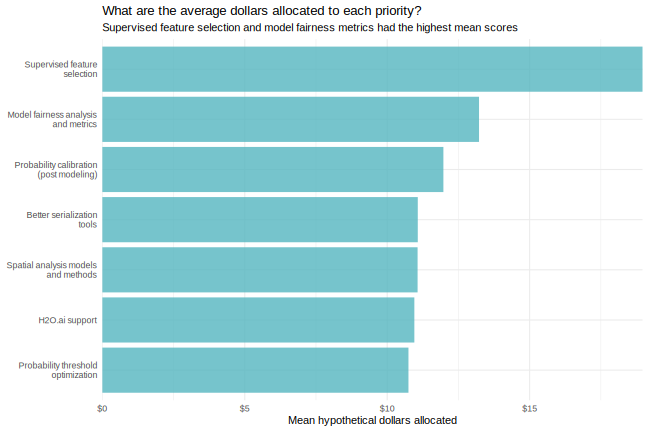

class: title-slide, left, middle
background-image: url("images/tidymodels.svg")
background-position: 85% 50%
background-size: 30%
background-color: #F9F8F3

.pull-left[

# `r rmarkdown::metadata$title`

### `r rmarkdown::metadata$author`

### `r rmarkdown::metadata$slides`

]

---
# What is tidymodels?

The tidymodels framework is a collection of packages for modeling and machine learning using tidyverse principles.

If you are getting started, we suggest taking a look at: 


.code70[

.pull-left-a-lot[


```{r, include = FALSE}
options(width = 60)
```

```{r, warning=FALSE}
library(tidymodels)
```
]

]

.pull-right-a-little[

* [`tidymodels.org`](https://www.tidymodels.org/)

* _Tidy Modeling with R_ ([`tmwr.org`](https://www.tmwr.org/))

]


```{r startup, include = FALSE}
library(tidymodels)
library(embed)
library(knitr)
tidymodels_prefer()
thm <- theme_bw() + 
  theme(
    panel.background = element_rect(fill = "transparent", colour = NA), 
    plot.background = element_rect(fill = "transparent", colour = NA),
    legend.position = "top",
    legend.background = element_rect(fill = "transparent", colour = NA),
    legend.key = element_rect(fill = "transparent", colour = NA)
  )
theme_set(thm)
source("_common.R")
options(width = 100)
opts_chunk$set(digits = 3, fig.path = "images/")
```


---
layout: false
class: inverse, middle, center

# What's New?

---
# Documentation

* We now do quarterly blog posts at [`tidyverse.org\blog`](https://www.tidyverse.org/blog/)

* `TMwR` is nearly complete (and we are working with a publisher)

* `r pkg(parsnip)` model documentation

 - There are now engine-specific pages for each model/engine combination. 
 - Dynamic based on loaded packages (this may change). 
 - We will update to include the new mode of "censored regression".


---
# Default engines

All model engines in `r pkg(parsnip)` now have default engines. For example: 

```{r}
args(linear_reg)
```

```{r}
args(decision_tree)
```

---
# Common interface for object extraction

Previously, we had a smattering of `pull_*()` objects that could get a specific item from an object (e.g., `pull_workflow()`).

There are now a set of S3 methods called `extract_*()` that are much better:

.pull-left[
* `extract_fit_engine()`
* `extract_fit_parsnip()`
* `extract_mold()`
* `extract_preprocessor()`
]
.pull-right[
* `extract_recipe()`
* `extract_spec_parsnip()`
* `extract_workflow()`
* `extract_workflow_set_result()`
]

---
# Recipes updates

* Can retain original predictors (with a common interface)

* More specific selectors

* New steps for sparse PCA analysis (in `r pkg(embed)`), multi-choice dummy variables (`r pkg(textrecipes)`) and more.  

```{r, eval = FALSE, highlight.col = "#ADD8E6"}
library(beans)
library(embed)

recipe(class ~ ., data = beans) %>% 
  step_pca(all_predictors())
```

---
# Recipes updates

* Can retain original predictors (with a common interface)

* More specific selectors

* New steps for sparse PCA analysis (in `r pkg(embed)`), multi-choice dummy variables (`r pkg(textrecipes)`) and more.  

```{r, eval = FALSE, highlight.col = "#ADD8E6"}
library(beans)
library(embed)

recipe(class ~ ., data = beans) %>% 
  step_pca(all_numeric_predictors()) #<<
```

---
# Recipes updates

* Can retain original predictors (with a common interface)

* More specific selectors

* New steps for sparse PCA analysis (in `r pkg(embed)`), multi-choice dummy variables (`r pkg(textrecipes)`) and more.  

```{r, eval = FALSE, highlight.col = "#ADD8E6"}
library(beans)
library(embed)

recipe(class ~ ., data = beans) %>% 
  step_pca(all_numeric_predictors(), keep_original_cols = TRUE)#<<
```


---
# Recipes updates

* Can retain original predictors (with a common interface)

* More specific selectors

* New steps for sparse PCA analysis (in `r pkg(embed)`), multi-choice dummy variables (`r pkg(textrecipes)`) and more. 

```{r, eval = FALSE, highlight.col = "#ADD8E6"}
library(beans)
library(embed)

recipe(class ~ ., data = beans) %>% 
  step_pca_sparse_bayes(all_numeric_predictors(), keep_original_cols = TRUE)#<<
```

---
layout: false
class: inverse, middle, center

# What's Cooking?


---
# Case weights

There is a lot of interest for this feature but it is deceivingly difficult: 

* How do we resample? 

* Do we require case weights for performance metrics? 

* What to do about recipe steps that don't handle weights? 

Answers are affected by the type of weights (e.g., frequency weights versus importance weights, etc.)

The work is in-process and affects all of our core packages. 

---
# Censored regression

Censoring is usually a characteristic of time-to-event data. For example:

> We know that the dog has been at the shelter for 10 days but is not yet adopted.

In this case, the time-to-adoption is 10 and _censored_. 

R is particularly strong in _survival analysis_ but 

* The quality of the packages is extremely uneven. 
* Some of the core packages were written without regard to developers programming with them. 
* User interfaces differ wildly. 

This is the _raison d'etre_ for tidymodels. 

---
# The censored package

We add a new mode of `"censored regression"`: 

```{r, warning = FALSE}
# remotes::install_github("tidymodels/censored")
library(censored)

sparse_cox <- 
  proportional_hazards(penalty = 0.01) %>% 
  set_engine("glmnet") %>% 
  fit(Surv(time, status) ~ age + ph.ecog + strata(sex), data = lung[-(1:3),])

time_pred <- 
  predict(sparse_cox, lung[1:3,], type = "survival", time = 1:1000)
time_pred
```

---
# The censored package

.pull-left[
```{r surv-plot-code, eval = FALSE}
time_pred %>% 
  mutate(sample = letters[1:3]) %>% 
  unnest(cols = .pred) %>% 
  ggplot(
    aes(
      x = .time, 
      y = .pred_survival,  
      col = sample
    )
  ) + 
  geom_step()
```
]
.pull-right[
  
```{r surv-plot, ref.label="surv-plot-code", echo = FALSE, out.width= '90%', fig.width=4, fig.height=4,fig.align='center', dev = 'svg', dev.args = list(bg = "transparent")}
```

] 

---
# Current model slate

| model                 | engine   | time | survival | linear\_pred | raw | quantile | hazard |
|:----------------------|:---------|:-----|:---------|:-------------|:----|:---------|:-------|
| bag\_tree             | rpart    | ✓    | ✓        | x            | x   | x        | x      |
| boost\_tree           | mboost   | x    | ✓        | ✓            | x   | x        | x      |
| decision\_tree        | rpart    | ✓    | ✓        | x            | x   | x        | x      |
| decision\_tree        | party    | ✓    | ✓        | x            | x   | x        | x      |
| proportional\_hazards | survival | ✓    | ✓        | ✓            | x   | x        | x      |
| proportional\_hazards | glmnet   | x    | ✓        | ✓            | ✓   | x        | x      |
| rand\_forest          | party    | ✓    | ✓        | x            | x   | x        | x      |
| survival\_reg         | survival | ✓    | ✓        | x            | x   | ✓        | ✓      |
| survival\_reg         | flexsurv | ✓    | ✓        | x            | x   | ✓        | ✓      |

Give us feedback at [`rstd.io/censored-feedback`](https://rstd.io/censored-feedback)!


---
# Model operations

Julia Silge is working on this and has an initial release of the `r pkg(vetiver)` package on CRAN. 

* Can publish, version, and deploy different types of models using the `r pkg(pins)` and `r pkg(plumber)` packages.

* We will be adding features related to monitoring and other operations. 

Devel version works with for `lm`, `r pkg(xgboost)`, `r pkg(caret)`, `r pkg(mlr3)`, and tidymodels objects. 

---
# vetiver model storage

```{r}
# remotes::install_github("tidymodels/vetiver")
library(vetiver)

data(Sacramento, package = "modeldata")

rf_spec <- rand_forest(mode = "regression")
rf_form <- price ~ type + sqft + beds + baths

rf_fit <- 
    workflow(rf_form, rf_spec) %>%
    fit(Sacramento)

vet_mod <- vetiver_model(rf_fit, "sacramento_rf")
vet_mod
```


---
# Version and share and deploy a model 

```{r}
library(pins)
model_board <- board_temp()
model_board %>% vetiver_pin_write(vet_mod)
```

```{r eval = FALSE}
library(plumber)
pr() %>%
  vetiver_pr_predict(vet_mod) %>%
  pr_run(port = 8088)
```

Let's look at a deployed model for predicting "movie or tv show" from a textual description


---
# 2021 User survey results

```{r time, echo = FALSE, fig.align='center', out.width="80%"}

```


---
# User experience

```{r users, echo = FALSE, fig.align='center', out.width="80%"}

```


---
# User roles

```{r roles, echo = FALSE, fig.align='center', out.width="80%"}

```

---
# Spend hypothetical $100

```{r results, echo = FALSE, fig.align='center', out.width="75%"}

```


---

# Thanks

Thanks for the invitation to speak today!

The tidymodels team: Davis Vaughan, Julia Silge, and Hanna Frick. Emil Hvitfeldt starts on 2021/12/08.

Special thanks for the other folks who contributed so much to tidymodels: Edgar Ruiz, Alison Hill, Desirée De Leon, and the tidyverse team.

These slides were made with the [`xaringan`](https://bookdown.org/yihui/rmarkdown/xaringan.html) package and styled by Alison Hill. 
